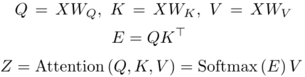
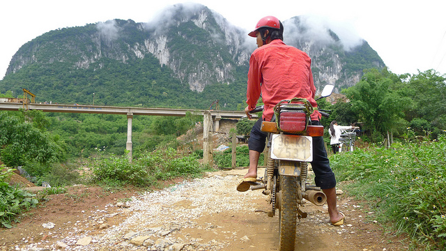

# Transformer_model
 - A pytorch implementation of [Attention Is All You Need (Transformer)](https://arxiv.org/abs/1706.03762) for image captioning.
 - Add SCST training from "[Self-critical Sequence Training for Image Captioning](https://openaccess.thecvf.com/content_cvpr_2017/html/Rennie_Self-Critical_Sequence_Training_CVPR_2017_paper.html)".
 - Clear and easy to learn.

## Environment
 - Python 3.7
 - Pytorch 1.3.1

## Method
### 1. Architecture

### 2. Main Process

## Usage
### 1. Preprocessing
Extract image features by ResNet-101 (denoted as **grid-based features**) and process coco captions data (from [Karpathy splits](https://cs.stanford.edu/people/karpathy/deepimagesent/caption_datasets.zip)) through `preprocess.py`. Need to adjust the parameters, where `resnet101_file` comes from [here](https://drive.google.com/drive/folders/0B7fNdx_jAqhtbVYzOURMdDNHSGM). Image features can also be obtained from [here](https://github.com/peteanderson80/bottom-up-attention) or extracted using [ezeli/bottom_up_features_extract](https://github.com/ezeli/bottom_up_features_extract) repository (from [Bottom-Up Attention](https://openaccess.thecvf.com/content_cvpr_2018/html/Anderson_Bottom-Up_and_Top-Down_CVPR_2018_paper.html) paper, using fixed 36 features per image, denoted as **region-based features**).

This project is not limited to the MSCOCO dataset, but you need to process your data according to the data format in the `preprocess.py` file.

### 2. Training
 - First adjust the parameters in `opt.py`:
    - train_mode: 'xe' for pre-training, 'rl' for fine-tuning (+SCST).
    - learning_rate: '4e-4' for xe, '4e-5' for rl.
    - resume: resume training from this checkpoint. required for rl.
    - N_enc/N_dec: number of encoder/decoder layers, the default is 4.
    - other parameters can be modified as needed.
 - Run:
    - `python train.py`
    - checkpoint save in `checkpoint` dir, test result save in `result` dir.

### 3. Test
 - `python test.py -t model.pth -i image.jpg`
 - only applicable to the model trained by grid-based features.
 - for region-based features, you can first extract the image feature through [ezeli/bottom_up_features_extract](https://github.com/ezeli/bottom_up_features_extract) repository, and then simply modify the `test.py` file to use.

## Result
### Evaluation metrics
*XE* represents Cross-Entropy loss, and *+SCST* means using reinforcement learning to fine-tune the model (using CIDEr reward).

|features|training|Bleu-1|Bleu-2|Bleu-3|Bleu-4|METEOR|ROUGE_L|CIDEr|SPICE|
|:---:|:---:|:---:|:---:|:---:|:---:|:---:|:---:|:---:|:---:|
|grid-based|XE|74.3|57.8|44.4|34.0|27.3|55.2|109.5|20.3|
|grid-based|+SCST|78.5|62.8|48.5|36.8|27.9|57.0|121.3|21.8|
|region-based|XE|76.3|60.2|46.3|35.5|27.7|56.2|113.4|20.7|
|region-based|+SCST|79.9|64.4|50.0|38.3|28.7|58.3|127.3|22.4|

### Examples

||
|:---:|
|a man riding a motorcycle down a dirt road.|
||
|a bunch of knives sitting on top of a wooden cutting board.|
